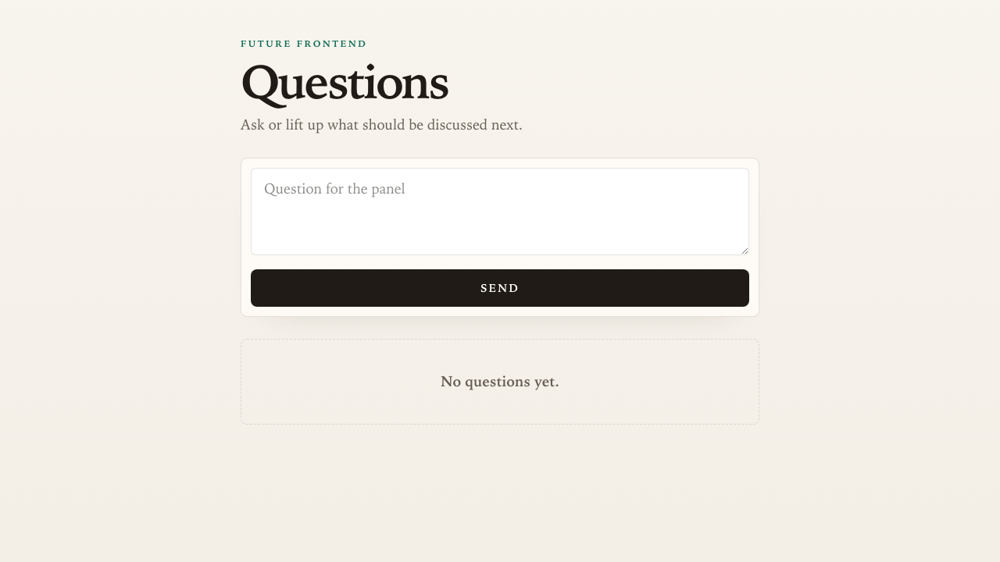

# Future Frontend Panel Questions

This repository ships a small Cloudflare Worker application for collecting, moderating, and displaying audience questions during Future Frontend conference panels.

This is a template for my vibecoding projects and it captures what I consider my best practices so I don't have to repeat them for each experiment.

The repo vendors ASDLC reference material in `.asdlc/` as local guidance instead of recreating it per project. Repo-specific truth lives in `ARCHITECTURE.md`, `specs/`, and `docs/adrs/`: generated code still needs to match those documents, and passing CI alone is not enough.

Local development in this repo targets macOS. Other platforms may need script and tooling adjustments before the baseline workflow works as documented.

## Documentation

- Development setup and local CI: `docs/development.md`
- Architecture decisions: `docs/adrs/README.md`
- Feature and architecture specs: `specs/README.md`
- Agent behavior and project rules: `AGENTS.md`
- Partial-upgrade capability kits: `.capabilities/`

## Runtime

- Run `nvm use` before `npm install` or any other development command so your shell picks up the repo-pinned Node.js version from `.nvmrc` and stays close to the expected npm baseline.
- Install dependencies with `npm install`.
- `npm install` also configures the repo-managed `pre-push` hook so `git push` runs `npm run quality:gate:fast` before code leaves your machine.
- The exact project Node.js version is pinned in `package.json` and mirrored in `.nvmrc` for `nvm` users, and CI reads the `package.json` value directly.
- npm is also pinned exactly in `package.json`; local development is expected to use `nvm use`, and CI upgrades npm to the exact repo pin when the bundled npm version differs.
- Copy `.dev.vars.example` to `.dev.vars` before running projects that need local secrets.
- Use repo-pinned CLI tools through `npx`, including `npx wrangler` for Cloudflare-based experiments.
- Start the Worker with `npm run dev`, then open `http://127.0.0.1:8787`.
- Rebuild the generated Tailwind stylesheet manually with `npm run build:css` when needed.

## Panel App

Set these values in `.dev.vars` locally and as Worker secrets in production:

- `AUTH_SECRET`: long random string used to sign role cookies
- `MC_PASSCODE`: passcode for the MC view
- `MODERATOR_PASSCODE`: passcode for the moderator view

Routes:

- `GET /`: attendee view for the active moderator-selected mode: QA questions or word-cloud submissions and votes
- `GET /present`: read-only attendee-style view for presenting the active QA queue or word cloud, with automatic updates
- `GET /mc`: passcode-protected MC view for choosing the live question and marking it done, with automatic updates
- `GET /moderate`: passcode-protected moderator view for approving, adding, voting, hiding, merging, ending, resetting, and switching panel mode, with QA as the default mode
- `GET /screen`: beamer view showing the active question, with automatic updates
- `GET /words/screen`: beamer view showing approved word-cloud entries, with automatic updates
- `GET /api/health`: JSON health response for smoke tests and tooling

Panel state is coordinated through a SQLite-backed Cloudflare Durable Object room. The moderator reset clears it explicitly. Ended word-cloud data stays visible to the moderator until reset.

Already-open panel pages subscribe to Durable Object server-sent events and refresh their server-rendered fragments after state changes. The browser module keeps interval polling as a fallback if the event stream is unavailable.

The moderator controls whether `/` is in QA or wordcloud mode. In QA mode, `/moderate` shows questions to moderate. In wordcloud mode, `/moderate` shows word-cloud controls instead.

Regular attendee interactions stay at `/`: asking questions, submitting words, and voting all post back to `/` regardless of the active panel mode. Attendees see their own pending submissions as under consideration and cannot vote for questions or words they submitted.

Anonymous attendee identity is cookie-based. This prevents accidental repeat votes in one browser session, but it is not a strong abuse-control boundary: an attendee can clear cookies, use another browser, or use another device to receive a fresh attendee identity. The app also throttles submissions and votes by Cloudflare client IP as a best-effort backstop, but shared conference networks and mobile network changes make IP limits unsuitable as a hard identity model.

If a future event needs stronger controls, the lightweight options are to sign attendee cookies to prevent forged IDs, add stricter per-IP voting caps, or issue short-lived join tokens from a check-in or QR flow. Each option adds tradeoffs: signed cookies still reset when deleted, IP binding can block legitimate attendees behind shared networks, and join tokens or real authentication change the anonymous low-friction workflow.

## Deploy To Cloudflare

Before deploying, choose the production Worker name in `wrangler.jsonc`. The default is currently `vibe-template-worker`.

The production Worker uses:

- `PANEL_ROOM`: Durable Object binding for the shared panel room
- `PanelRoom`: Durable Object class exported from `src/worker.ts`
- `v1`: SQLite-backed Durable Object migration in `wrangler.jsonc`
- `AUTH_SECRET`, `MC_PASSCODE`, and `MODERATOR_PASSCODE`: Worker secrets

Keep the Durable Object binding and migration in the deployed config. Removing or renaming them after deployment can strand existing room state.

1. Authenticate Wrangler:

   ```sh
   npx wrangler login
   ```

2. Review the Cloudflare config:

   ```sh
   npx wrangler deploy --dry-run
   ```

   Confirm the output targets the expected Worker name and includes the `PanelRoom` Durable Object migration.

3. Create strong production values for the required secrets:

   ```sh
   openssl rand -base64 48
   ```

4. Store the secrets in Cloudflare Workers. Do not commit production values to `.dev.vars`.

   ```sh
   npx wrangler secret put AUTH_SECRET
   npx wrangler secret put MC_PASSCODE
   npx wrangler secret put MODERATOR_PASSCODE
   ```

5. Run the local release checks:

   ```sh
   npm run quality:gate
   npm run ci:local
   ```

6. Deploy:

   ```sh
   npm run deploy
   ```

7. Smoke-test the deployed Worker:
   - Open `/api/health` and confirm it returns `{"ok":true,...}`.
   - Open `/`, `/present`, `/mc`, `/moderate`, `/screen`, and `/words/screen`.
   - Confirm MC and moderator views require the production passcodes.
   - Submit a question and a word from attendee tabs, approve them in `/moderate`, and confirm already-open attendee/screen pages update without refresh.
   - Use `/moderate` reset before opening the room to attendees.

The app keeps questions and word-cloud data in the `PanelRoom` Durable Object. The current config uses one default room for the event. Use moderator reset to clear it between panels.

## Verification

- Run the fast local gate with `npm run quality:gate:fast` during normal iteration.
- Run the baseline repo gate with `npm run quality:gate`.
- Run the containerized local workflow with `npm run ci:local`.
- The repo-managed `pre-push` hook runs `npm run quality:gate:fast` automatically after `npm install`.
- If local Agent CI warns about `No such remote 'origin'`, set `GITHUB_REPO=owner/repo` in `.env.agent-ci`.
- Retry a paused local CI run with `npm run ci:local:retry -- --name <runner-name>`.
- Install the pinned Playwright browser with `npm run playwright:install`.
- Run unit tests from colocated `src/**/*.test.ts` files with `npm test`.
- Run browser tests from colocated `src/**/*.e2e.ts` files with `npm run e2e`.
- Run mutation tests against runtime `src/**/*.ts` files with `npm run mutation`.

## Capability Kits

Use `.capabilities/` when another project needs one template practice without adopting the whole starter. Each kit is a reviewable partial-upgrade guide with a README, manifest, package-manager recipe, copyable files, and validation checks.

To apply a kit to another repo:

1. Pick the smallest matching kit from `.capabilities/README.md`.
2. Read the kit README and `manifest.json`.
3. Follow the target package-manager recipe under `recipes/`.
4. Copy or merge files from `files/` without overwriting target-project conventions.
5. Ask before applying optional adjacent setup such as creating a GitHub Actions workflow.
6. Run the kit checks and the target repo's normal quality gate.

For existing projects where the right kit set is unclear, start with the negotiation prompt in `.capabilities/README.md`. It asks an agent to inspect the target repo, present a checkbox-style capability pull plan, and wait for approval before editing files.

## Source Layout

- `src/worker.ts` is the Worker entry point and top-level router.
- `src/api/` holds API response modules such as the health endpoint.
- `src/panel/` holds panel question state and role-auth helpers.
- `src/views/` holds HTML rendering modules for the panel UI.
- Tests live next to the code they exercise under `src/`.

## Application Screenshot



Refresh this asset manually when the panel UI changes materially.
